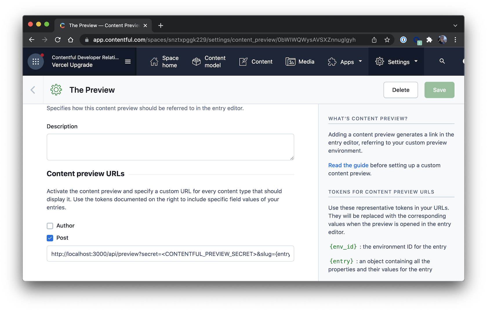
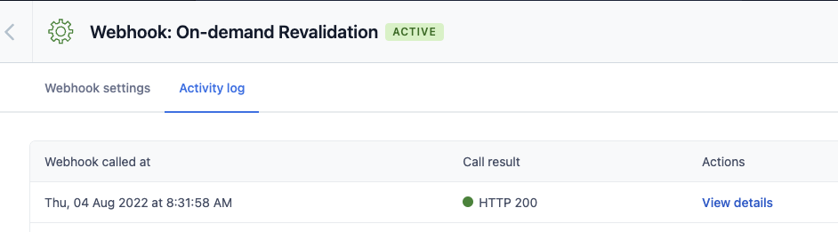

# Statically Generated Design Portfolio

Designed by and featuring Steven Vasil.
## Tech
- Next.js
- Contentful
- Emotion

### TODO
#### Setup Preview Mode:

In your Contentful space, go to **Settings > Content preview** and add a new content preview for development.

The **Name** field may be anything, like `Development`. Then, under **Content preview URLs**, check **Post** and set its value to:

```
http://localhost:3000/api/preview?secret=<CONTENTFUL_PREVIEW_SECRET>&slug={entry.fields.slug}
```

Replace `<CONTENTFUL_PREVIEW_SECRET>` with its respective value in `.env.local`.



Once saved, go to one of the posts you've created and:

- **Update the title**. For example, you can add `[Draft]` in front of the title.
- The state of the post will switch to **CHANGED** automatically. **Do not** publish it. By doing this, the post will be in draft state.
- In the sidebar, you will see the **Open preview** button. Click on it!


You will now be able to see the updated title. To exit preview mode, you can click on **Click here to exit preview mode** at the top of the page.

#### Enable On-Demand Revalidation

In your Contentful space, go to **Settings > Webhooks** and add a new webhook:

- **Give the webhook a name**
- **Activate:** Check the activate checkbox to ensure the webhook is marked as active
- **Specify the POST URL:** Using the URL from your Vercel deployment in step 8, add the path `/api/revalidate` at the end, so it would look something like:

  ```
  https://<YOUR_VERCEL_DEPLOYMENT_URL>/api/revalidate
  ```

  Replace `<YOUR_VERCEL_DEPLOYMENT_URL>` with your own deployment URL as noted in the Vercel dashboard.

- **Specify Triggers:** You can choose to trigger for all events or specific events only, such as the Publishing and Unpublishing of Entries and Assets, as shown below.

  

- **Specify Secret Header:** Add a secret header named `x-vercel-reval-key` and enter the value of the
  `CONTENTFUL_REVALIDATE_SECRET` from before.

  

- **Set Content type:** Set content type to `application/json` in the dropdown.

  

- **Edit post:** Now, try editing the title of one of your blog posts in Contentful and click Publish. You should see the changed reflected in the website you just deployed, all without triggering a build! Behind the scenes a call was made to the revalidate api that triggers a revalidation of both the landing page and the specific post that was changed.

  

- **Verify:** You can verify if your request was made successfully by checking the webhook request log on Contentful and checking for a successful 200 status code, or by having your functions tab open on Vercel when committing the change (log drains may also be used). If you are experiencing issues with the api call, ensure you have correctly entered in the value for environment variable `CONTENTFUL_REVALIDATE_SECRET` within your Vercel deployment.

  
